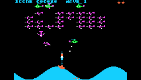

# Wavy Navy

A faithful recreation of Wavy Navy, a shoot-em-up originally written by Rodney McAuley and published by Sirius Software for the Apple II in 1983. This version preserves the gameplay, feel, and character of the original while making it easier to experience today.

## Game Features
- Gun platform on rolling waves!
- Intricate enemy plane dive attack maneuvers
- Multiple enemy types: planes, helis, mines, bombers, missles
- Detailed explosion animations
- Three difficulty levels (beginner, advanced, expert)
- Plays nautical-themed musical tunes between levels

## Controls

- ← / → moves your boat left/right
- btn Ⓐ / key 🆉 fires

- From the title screen, press btn Ⓐ / key 🆉 to start the game, and ← or → to set the difficulty.

- Hold ↓ and btn Ⓐ / key 🆉 for 4 seconds to reset the high score.

- Hold ↑ and btn Ⓐ / key 🆉 for 4 seconds to change the visual display mode *(color monitor, green phosphor, or white phosphor)*.

> AI Disclosure: AI was used to analyze the original game and to generate the code for the remake.
